[//]: # (
http://www.w3schools.com/css/css_font.asp
http://www.cssfontstack.com/Helvetica
)

<style>
/* justify text: */
body {
  text-align: justify
}

/* gdbar size (that contains logo) on title page */
/* needs to have greater height than logo image, other stuff is irrelevant */
.gdbar {
  position:absolute !important;
  top: 50px !important; left: auto; right: 0px !important; width: 0px !important;
  height: 500px !important;  /* modify if logo is larger than this in height */
}

/* logo size on title page */
.gdbar img {
  position: absolute; 
  top: 0px;
  left: 50px;
  width: 154px !important;
  height: 127px !important;
}

/* logo size on slides */
slides > slide:not(.nobackground):before {
  width: 77px; height: 64px; /* modify width and height (twice) */
  background-size: 77px 64px;
  position: absolute; left: auto;
  right: -30px;  /* modify position */
  top: 10px;
}

/*slides > slide.backdrop {   */
/*  background-color:#ffaaaa;   */
/*  background:#ffaaaa;   */
/*}   */
</style>

<script type="text/x-mathjax-config">
MathJax.Hub.Config({
  jax: ["input/TeX", "output/HTML-CSS"],
  "HTML-CSS": { 
      preferredFont: "Arial", 
      availableFonts: [],
      scale: 85
      // styles: {".MathJax": {color: "#CCCCCC"}} 
      }
});
</script>


```{r setup, include=FALSE}
#knitr::opts_chunk$set(echo = TRUE, eval = FALSE)
knitr::opts_chunk$set(echo = FALSE, eval = TRUE)
```


## [[todo]]

* Figure and Table numbering? --> rather not.
* figure caption in separate column with font facing upwards (90% rotated)?
* Features: continuous, not categorical (!) -- in data prep slide!
* References: Accessed at?
* Link to github repo (full analysis, notebook synopsis)
* move stuff to css file and bibtex file
* make pdf and link it into presentation

## Abstract

This piece of work investigates to what extent and how weather and 
time of day influence bike rentals in a public bike sharing system in Montreal.
Public data obtained from the Canadian government’s past weather and 
climate service as well as bike sharing data available from kaggle are
analyzed via a simple baseline model (moving average) and a more complex 
machine learning model (gradient boosting regression). Partial dependence
plots (PDP) and individual conditional expectation plots (ICE) are used
to visualize the influences of the different factors.

Results show that the model can explain the number of hourly bike rides very
well ($93.3\%$ of variance explained). The most important influences on the 
number of bike rides seem to be temperature, atmospheric pressure, hour
of the day and relative humidity, but there are strong interactions between
these influences: For example, the number of predicted bike rides increases
with temperature, but only if relative humidity is not too high. 

The full analysis is available in multiple python files on github:  [kgl-cycle-share-main-file.py](https://github.com/ingonader/python-for-data-science-edx/blob/master/week-09-and-10-final-project/kgl-cycle-share-main-file.py).
<br>
A synopsis is available as an ipython notebook [cycle-share-analysis-synopsis.ipynb](https://github.com/ingonader/python-for-data-science-edx/blob/master/week-09-and-10-final-project/cycle-share-analysis-synopsis.ipynb).

## Motivation

> Describe the problem you want to solve with the data. It may relate closely with your research question, but your goal here is to make your audience care about the project/problem you are trying to solve. You need to articulate the problem you are exploring and why (and for whom) insight would be valuable.
 
## Dataset(s) {.smaller}


<div></div><!-- ------------------------------- needed, but don't put anything here -->
<div style="float: left; width: 48%;"><!-- ---- start of first column               -->

Two datasets were used: **Bike sharing data**...

* **BIXI Montreal public bicycle sharing system**, North America's first 
  large-scale bike sharing system
* Available via kaggle from<br> [https://www.kaggle.com/aubertsigouin/biximtl/home](https://www.kaggle.com/aubertsigouin/biximtl/home)
* For years $2014$ to $2017$
* Contains **individual records of bike trips**: timestamp and station code for 
  start and end of trip, duration
* $n = 14598961$ records (individual bike trips)
* Station codes, names, and position (latitude, longitude) 
  available in separate files, but only of secondary interest for this analysis

</div><!-- ------------------------------------ end of first column                 -->
<div style="float: left; width: 4%"><br></div><!-- spacing column -------- -->
<div style="float: left; width: 48%;"><!-- ---- start of second column              --> 

...and **weather data** from the Canadian government:

* Canadian government’s past weather and climate service, available from<br> [http://climate.weather.gc.ca/ 
  historical_data/ <br> search_historic_data_e.html](http://climate.weather.gc.ca/historical_data/search_historic_data_e.html)
* API for **bulk data download**:<br> [http://climate.weather.gc.ca/climate_data/ <br> bulk_data_e.html](http://climate.weather.gc.ca/climate_data/bulk_data_e.html)
* Data can be downloaded per weather station per month and contains 
  **hourly measurements** of different metrics (e.g., timestamp, temperature, 
  relative humidity, atmospheric pressure, wind speed; different measures 
  available for different stations)
* $n = 35064$ hourly weather records in total (between $672$ and $744$ per monthly file)

</div><!-- ------------------------------------ end of second column                -->
<div style="clear: both"></div><!-- end floating section for text over both cols below -->


## Data Preparation and Cleaning {.smaller}

<div></div><!-- ------------------------------- needed as is before cols - -->
<div style="float: left; width: 48%;"><!-- ---- start of first column ---- -->

* First, **data download** was performed manually for the bike share data 
  from kaggle (as only available after login), and via a Python script 
  for the weather data (bulk download).
* For the weather data, the **weather station** that was most central to the
  locations of the bike rides was picked (see data exploration).
* Next, the **data was loaded** and contatenated into a pandas `DataFrame` 
  each for individual bike rides and hourly weather data.
* The next step was **calculating the variable of interest: Hourly bike rides**. 
  This was done by aggregating individual bike trips to hourly counts of 
  trips (how many trips in each hour), using the starting time of the trip.
* Then, the **weather data was joined to the hourly bike ride data**, 
  using the common timestamp as join key.

</div><!-- ------------------------------------ end of first column ------ -->
<div style="float: left; width: 4%"><br></div><!-- spacing column -------- -->
<div style="float: left; width: 48%;"><!-- ---- start of second column --- --> 

* One feature **(wind chill) was dropped**, as it had too many 
  missing values ($77.9\%$ missing).
* Finally, **additional features were added** for the analysis: 
  hour of the day ($0$-$23$), day of the week ($0$-$6$, zero corresponding 
  to Monday, six corresponding to Sunday), month ($1$-$12$).
* These features, despite being categorical in nature, were kept as
  **continuous features**, as this proved to have more predictive
  power in the models.
* For modeling, **rows with missing values were dropped**, as the goal 
  is not having the most complete prediction coverage, but rather an 
  indication of the prediction quality that is possible with complete data. 
  In total, $1284$ rows ($0.04\%$) of the original data were dropped.
* The remaining rows were **split into training and testing set** ($90\%$ of the data, 
  $n = 26168$ rows for training, the remaining $10\%$, $n = 2908$ for testing).

</div><!-- ------------------------------------ end of second column ----- -->
<div style="clear: both"></div><!-- end cols for text over both cols below -->


## Research Question(s)

The research questions that I wanted to answer with my analysis were:

* **To what extent do** the number of **bike rides depend on the current 
  weather conditions**? That is, how well can the number of bike rides 
  be predicted from weather data (and time of year, time of day)?
* What are the **most important factors** that influence the number 
  of bike rides?
* **How do these factors influence** the number of bike rides? What are 
  the main effects of these factors, and what are the interactions between
  them?


## Methods

First, some **data exploration** was performed, in order to get to know the data 
and to find out how the number of hourly bike trips is distributed across the 
investigated time span. Also, the interrelation of features was investigated
by means of a correlation heatmap.

In order to find out how well the number of bike rides can be predicted 
from the data, different models were used As a **baseline model**, a moving
average was calculated to find out how this very simple model can explain the data.

Then, after splitting the data into $90\%$ training and $10\%$ test set, 
**different machine learning models** were fitted to the data in order to predict 
the hourly number of bike rides from the available data: Random forest regression, 
and gradient boosting regression via `scikit-learn` and `xgboost`. The most 
promising model, `scikit-learn`'s gradient boosting regression, was fitted
via a randomized $4$-fold cross-validation for indentifying the best hyperparameters.
Variable importance was used to identify the most important influence factors,
and *partial dependence plots* (*PDP*) [@pdp_plots] and 
*individual conditional expectation* (*ICE*) plots [@ice_plots] were used to 
**visualize the influences of the important variables** 
on the number of bike trips.


## Findings: Data Exploration


<div></div><!-- ------------------------------- needed, but don't put anything here -->
<div style="float: left; width: 53%"><!-- ---- start of first column               -->

The Canadian government's past weather and climate service provides data
from weather stations around the whole country. Fortunately, it offers a 
*search by proximity* function. Via this service, some sample data 
of the closest stations to
Montreal were downloaded. Each of the data files contains information about
the weather stations, including the geographical position (latitude and 
longitude). These coordinates were plotted on a map (see Figure on the right),
and the closest station to the bulk of the data was chosen (station name: 
*MCTAVISH*). Only data from this station was used.


</div><!-- ------------------------------------ end of first column                 -->
<div style="float: left; width: 4%"><br></div><!-- spacing column ----------------- -->
<div style="float: left; width: 43%"><!-- ---- start of second column              --> 
```{r, eval = TRUE, echo = FALSE, out.width = "100%", fig.align = "left"}
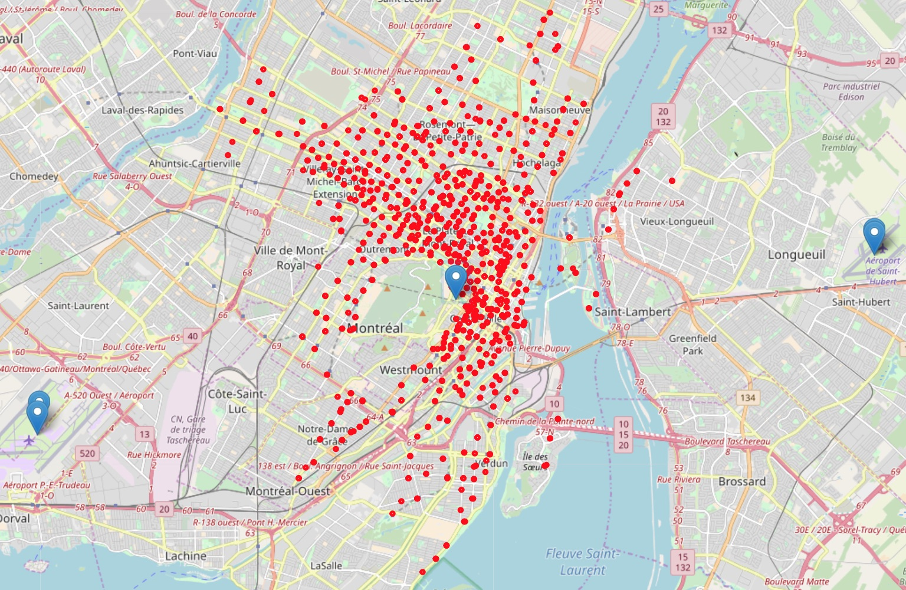
```
<p style="font-size: 12px; margin-top: 1%">
**Figure**: Plot shows all starting stations of a bike trip (red dots), as
well as the closest weather stations (blue markers). 
The closest station in the center is the *MCTAVISH* weather station 
(Climate Identifier 7024745, WMO Identifier 71612)
<p>

</div><!-- ------------------------------------ end of second column                -->


## Findings: Data Exploration

<div></div><!-- ------------------------------- needed, but don't put anything here -->
<div style="float: left; width: 53%"><!-- ---- start of first column               -->

To get a better understanding of the data, the number of hourly bike trips
was visualized for the time span between $2014$ and $2017$. 

The moving average that is shown in the plot (red line) can 
be interpreted as a *baseline model*, i.e., 
the simplest possible model to describe the hourly number of bike rides. 

This baseline model explains $38.8\%$ of the variance $(r^2 = 0.388)$ and has
a mean absolute error of $MAE = 316.2$, which means that on average, the "prediction" 
for the number of hourly bike rides is wrong by this many bike rides. 
This includes also winter months with no rides. For a more realistic estimation
of model quality, these numbers drop to $r^2 = .079$ and $MAE = 510.7$ when only 
considering the time frame from May to September.

</div><!-- ------------------------------------ end of first column                 -->
<div style="float: left; width: 4%"><br></div><!-- spacing column ----------------- -->
<div style="float: left; width: 43%; margin-top: -3%"><!-- ---- start of second column              --> 
```{r, eval = TRUE, echo = FALSE, out.width = "100%", fig.align = "left"}
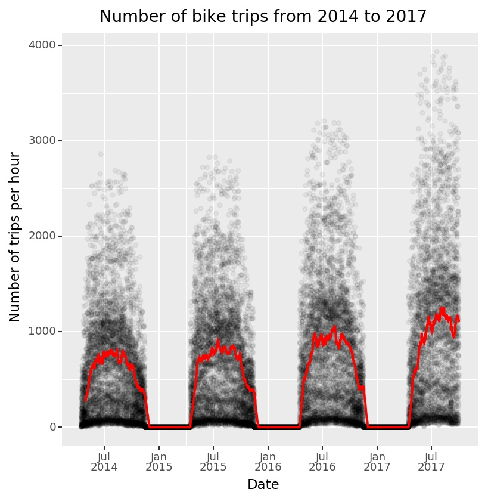
```
<p style="font-size: 12px">
**Figure**: Number of hourly rides from $2014$ to $2017$. Each dot represents the 
number of trips in one specifc hour. Red line represents a 
moving average using a window of $14$ days.
<p>

</div><!-- ------------------------------------ end of second column                -->


## Findings: Data Exploration

<div></div><!-- ------------------------------- needed, but don't put anything here -->
<div style="float: left; width: 53%"><!-- ---- start of first column               -->

To visualize the relations between the available features,
a correlation heatmap is shown on the right. The features are only
slightly correlated, with the only exception being temperature and dew point
that show an almost perfect (linear) relationship $(r = .93)$.

To avoid problems resulting from this multicollinearity, 
only temperature was used as a predictor,
and dew point was dropped. Despite the fact that that gradient boosting
is less influenced by multicollinearity, 
it might still influence calculations of variable importance  [@rf_or_gbm; @rf_imp].

</div><!-- ------------------------------------ end of first column                 -->
<div style="float: left; width: 4%"><br></div><!-- spacing column ----------------- -->
<div style="float: left; width: 43%; margin-top: 0%"><!-- ---- start of second column              --> 
```{r, eval = TRUE, echo = FALSE, out.width = "100%", fig.align = "left"}
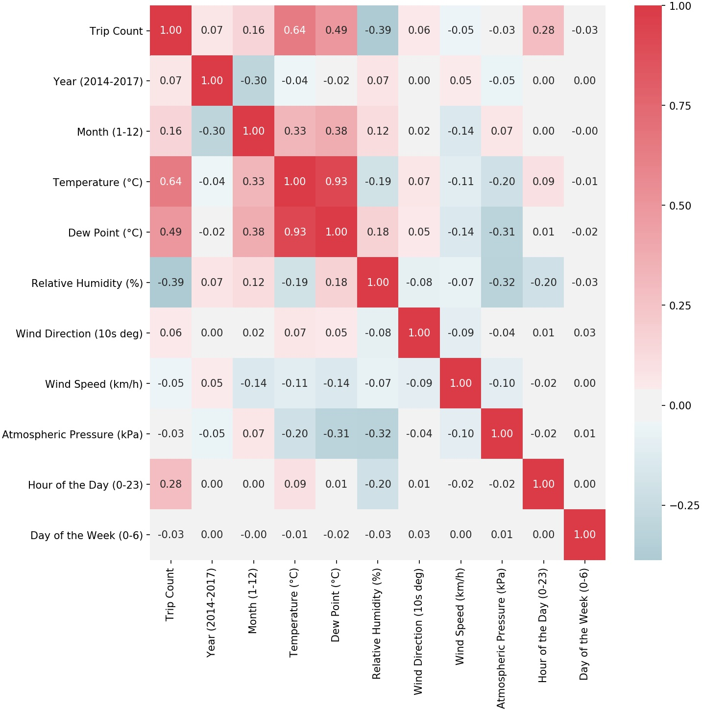
```
<p style="font-size: 12px">
**Figure**: Pearson Correlations between available features in the data.
<p>

</div><!-- ------------------------------------ end of second column                -->


## Findings: Model Fit

<div></div><!-- ------------------------------- needed, but don't put anything here -->
<div style="float: left; width: 53%"><!-- ---- start of first column               -->

<p style="font-size: 12px">
**Table**: Model performance measures for different models. $r^2$ is the amount 
of variance explained, $MAE$ stands for mean absolute error. $train$ and $test$ 
specify training and testing set, respectively. For the test set, some performance
measures were also re-computed for using only the summer months of the test set 
(May to September), indicated via the $summer$ subscripts.
</p>

<p style="margin-top: -4%">
|Model                        |  $r^2_{train}$|   $r^2_{test}$| $r^2_{summer}$| $MAE_{test}$| $MAE_{summer}$|
|:----------------------------|--------------:|--------------:|-------------------:|------------:|-------------------:|
|Gradient Boosting (XGBoost)  |        $0.889$|        $0.860$|                  NA|      $158.0$|                  NA|
|Random Forest                |        $0.913$|        $0.894$|                  NA|      $111.2$|                  NA|
|Gradient Boosting (sklearn)  |        $0.997$|        $0.941$|             $0.933$|       $85.4$|             $105.4$|
</p>

The explained variance of the different models tried ranged from 
$r_{test}^2 = 0.860$ to $r_{test}^2 = 0.941$ for the final model 
(all in the test set; see table).
The hyperparameters for the final model (gradient boosting via scikit-learn) 
were selected via randomized search using $4$-fold cross validation 
(using only the training set). 

The final model fits the data very well, explaining $94.1\%$ of the variance and 
exhibiting an average error of $85.4$ rides over all hourly predictions. 
This error only increases to $105.4$ if only summer months are considered. 


</div><!-- ------------------------------------ end of first column                 -->
<div style="float: left; width: 4%"><br></div><!-- spacing column ----------------- -->
<div style="float: left; width: 43%; margin-top: -3%"><!-- ---- start of second column              --> 
```{r, eval = TRUE, echo = FALSE, out.width = "100%", fig.align = "left"}
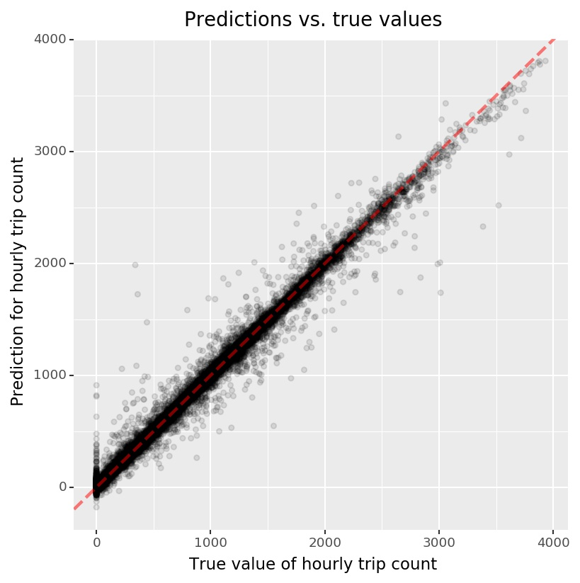
```
<p style="font-size: 12px">
**Figure**: The figure shows actual (true) values vs. predicted values for the
number of hourly bike trips for the final model. 
A perfect model would yield predictions that are
identical to the true values, i.e., all points would be on the $45°$ diagonal. 
This model is relatively close.
<p>

</div><!-- ------------------------------------ end of second column                -->


```{r}
# library(readr)
# model_runs <- readr::read_csv("../output/model_runs.csv", 
#                               col_types = cols(
#   timestamp = col_datetime(format = ""),
#   timestamp_str = col_datetime(format = ""),
#   filename_model = col_character(),
#   filename_out_prefix = col_character(),
#   mse_train = col_double(),
#   mse_test = col_double(),
#   mae_train = col_double(),
#   mae_test = col_double(),
#   mae_test_summer = col_double(),
#   r2_train = col_double(),
#   r2_test = col_double(),
#   r2_test_summer = col_double(),
#   r2_train_nonzero = col_double(),
#   r2_test_nonzero = col_double(),
#   comment = col_character()
# ))
# 
# varnames_table <- c("timestamp", "filename_model", "r2_train", "r2_test", "r2_test_summer",  "mae_test", "mae_test_summer")
# knitr::kable(model_runs[varnames_table])
```


## Findings: Most Important Features

<div></div><!-- ------------------------------- needed, but don't put anything here -->
<div style="float: left; width: 53%"><!-- ---- start of first column               -->

The most important features that influenced the prediciton of hourly bike 
rides were temperature and atmospheric pressure. While the former is easily 
comprehensible, the latter is best understood as a proxy for precipitation,
which was not available from the weather data: low pressure is commonly
related to rainy weather [@pressure_and_rain]. While relative humidity is 
not as tightly connected to rain [@humidity_and_rain], it interacts with 
temperature, e.g., it influences how (high) temperatures are perceived 
[@humidity_and_temp]. 

Further important predictors are the hour of the day and the day of the week,
as well as wind direction and speed. How these features influence the 
predicted number of bike trips is best detailed by specific plots, so-called
*partial dependence plots* (*PDP*) [@pdp_plots] and 
*individual conditional expectation* (*ICE*)
plots [@ice_plots].

</div><!-- ------------------------------------ end of first column                 -->
<div style="float: left; width: 4%"><br></div><!-- spacing column ----------------- -->
<div style="float: left; width: 43%; margin-top: -2%"><!-- ---- start of second column              --> 
```{r, eval = TRUE, echo = FALSE, out.width = "100%", fig.align = "left"}
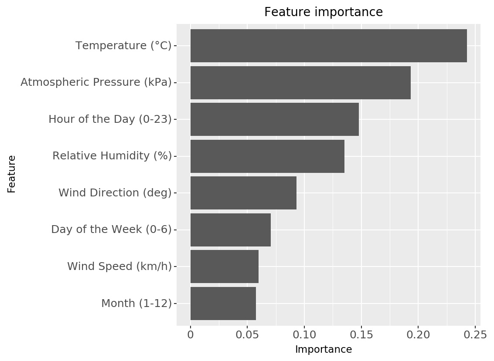
```
<p style="font-size: 12px">
**Figure**: Most important features in the best-fitting model, gradient
boosting via scikit-learn. The plot show the most important features and 
their relative importance for predicting the hourly number of bike trips.
The importance is indicating how well a feature performs in order to reduce
the mean squared error for predicting the outcome, averaged over all trees
in the ensemble. Values are normed and cannot be interpreted on an
absolute scale [@gbr_feat_imp].
<p>

</div><!-- ------------------------------------ end of second column                -->


## Findings: Main effects

<div></div><!-- ------------------------------- needed, but don't put anything here -->
<div style="float: left; width: 53%"><!-- ---- start of first column               -->

Regarding **hour of the day**, rush hours are clearly associated with higher
number of hourly bike rides. There is a peak at  at eight o'clock 
in the morning and a (less pronounced) one in the afternoon. It is also visible
that hour of the day interacts with other variables. First, the average PDP line
is misleading, as there is a dense area of parallel lines indicating higher bike
rides, as well as a high density at zero bike rides (i.e., the average PDP line
obscures these two clusters). Second, There are a few lines showing a different
pattern, starting to pick up only after the rush hour and steadily rising
until the afternoon. This might be the interaction with the day of the week
(see section *Interactions*; see also figure caption for more details about
PDP and ICE plots).

</div><!-- ------------------------------------ end of first column                 -->
<div style="float: left; width: 4%"><br></div><!-- spacing column ----------------- -->
<div style="float: left; width: 43%; margin-top: -5%"><!-- ---- start of second column              --> 
```{r, eval = TRUE, echo = FALSE, out.width = "100%", fig.align = "left"}
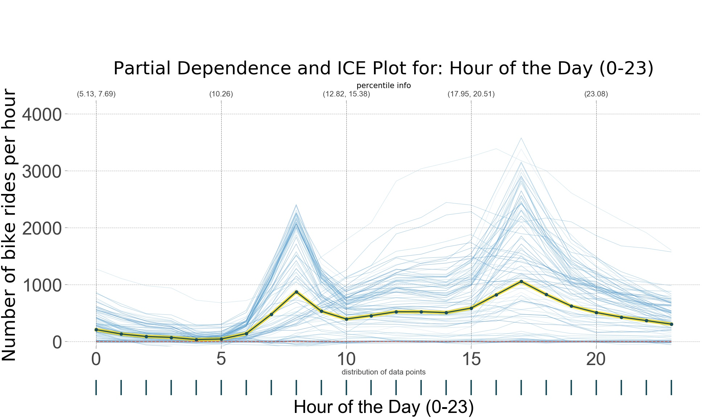
```
<p style="font-size: 12px; margin-top: 2%">
**Figure**: 
*Partial dependence plots* (*PDP*) [[@pdp_plots; @ice_plots] show the influence of a 
feature by detailing the effect on the target value ($y$-axis) over the 
whole range of the feature ($x$-axis). That is, the 
**thick, dark blue line** in the 
plot shows the main effect of a feature.
<br>
In addition, *individual conditional expectation* (*ICE*) plots [@ice_plots] 
quantify the extent of interactions that exist with other variables. The
**fine, light blue lines** in the plot show predictions at different levels of the feature
in question. If they are parallel, there are no interactions 
with other features. If they are not and show varying slopes compared to the
main affect, the feature interacts with other features.
<br>
In addition, the plot shows the **distribution of the data** over the whole
feature range as dark blue ticks below the $y$-axis. For hour of the day,
this is not very interesting (only full hours), but it shows areas with
sparse data for other features.
<p>

</div><!-- ------------------------------------ end of second column                -->
<div style="clear: both"></div><!-- end cols for text over both cols below -->


## Findings: Main effects

<div></div><!-- ------------------------------- needed, but don't put anything here -->
<div style="float: left; width: 53%"><!-- ---- start of first column               -->

Bike rides also rise with the **temperature**, the most important feature, once
it has reached a certain treshold of about two or three degrees celcius. The
rise is relatively steady up to a temperature or about 25 degrees celcius, 
where the number of hourly rides starts to level off and then to slightly
decline. It is also visible (from the spread of the ICE plot lines) that
there are massive interactions of temperature with other features.

For **relative humidity**, the main effect is less pronounced. The general
tendency is a slight decrease for higher humidity, with a more pronounced
drop around $95\%$. But the main effect is relatively weak compared to the
overall spread of the ICE plot lines, and there are strong interactions 
with other features for higher relative humidity.

</div><!-- ------------------------------------ end of first column                 -->
<div style="float: left; width: 4%"><br></div><!-- spacing column ----------------- -->
<div style="float: left; width: 43%; margin-top: -5%"><!-- ---- start of second column              --> 
```{r, eval = TRUE, echo = FALSE, out.width = "100%", fig.align = "left"}
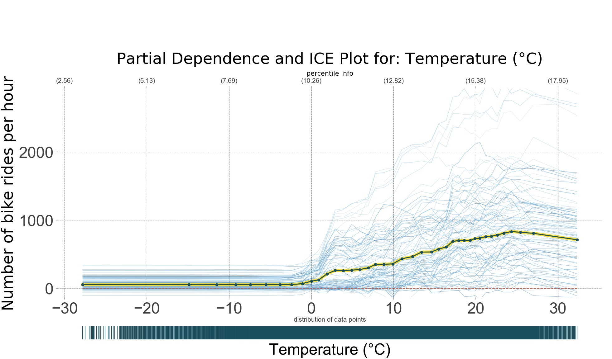
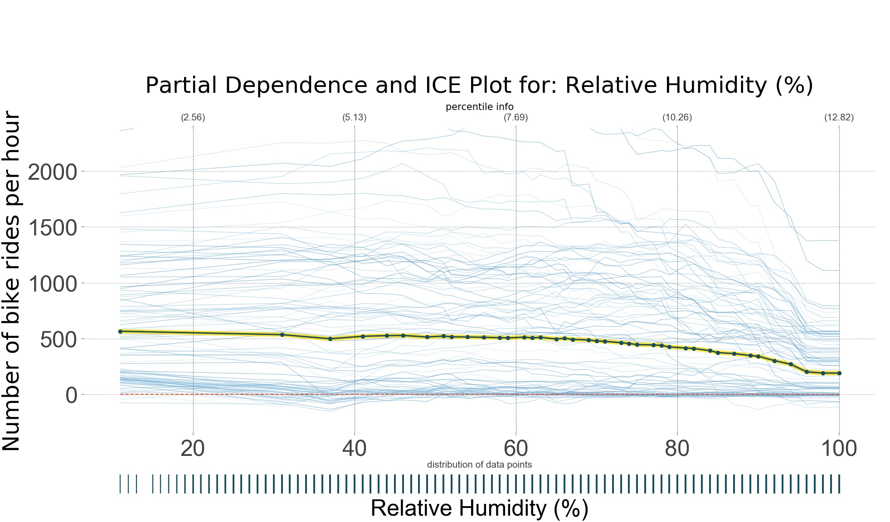
```
<p style="font-size: 12px; margin-top: 2%">
**Figure**: 
*Partial dependence plots* (*PDP*; thick, dark blue lines) [@pdp_plots] and 
*individual conditional expectation* (*ICE*) plots [@ice_plots] 
(thin, light blue lines). 
For a more detailed explanation, see first occurence of this plot type on the
previous page.
<p>
</div><!-- ------------------------------------ end of second column                -->
<div style="clear: both"></div><!-- end cols for text over both cols below -->


## Findings: Interactions

<div></div><!-- ------------------------------- needed, but don't put anything here -->
<div style="float: left; width: 53%"><!-- ---- start of first column               -->

The interaction between **day of the week and hour of the day** is not
the strongest interaction in this model (see note on the side), 
but it serves well to describe the
two-feature partial dependence plots (for details, see figure caption). 
It is clearly visible that during week days ($0$-$4$), there are 
peaks in the number of predicted hourly bike rides between 
$7$ and $8$ o'clock in the morning, as well as an even more 
pronounced peak in the afternoon (higher predicted
numbers, as well as a broader peak). The number or predicted bike rides
is slightly lower on Monday mornings.

During the weekend (days $5$ and $6$), the distribution is different (i.e.,
there is an interaction between the two features). There are by far fewer
predicted bike rides, also the peak is in the afternoon. Additionally, there
are more bike rides during the night, as compared to weekdays.

</div><!-- ------------------------------------ end of first column                 -->
<div style="float: left; width: 4%"><br></div><!-- spacing column ----------------- -->
<div style="float: left; width: 43%; margin-top: -11%"><!-- ---- start of second column              --> 
```{r, eval = TRUE, echo = FALSE, out.width = "100%", fig.align = "left"}
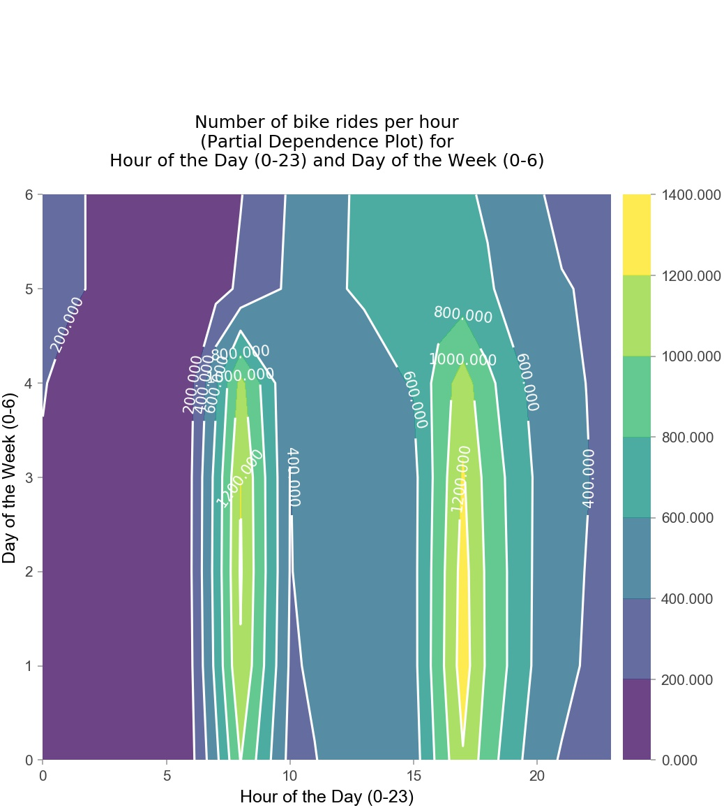
```
<p style="font-size: 12px; margin-top: 2%">
**Figure**: Partial dependence plots (PDPs) [@pdp_plots; @ice_plots] for two features. 
These plots show the two-way interactions of features (as the number of predicted
hourly bike rides, coded as the color in the plot) as a function of 
the features, in this case day of the week and hour of the day.
These plots do not show further, higher-order interactions with other features.
<p>

<p style="font-size: 12px; margin-top: -2%">
**Note**: The strength of two-way interactions was determined by estimating a
gradient boosting regression model similar to the model described before,
but with using main effects and two-way interactions as distinct features.
<p>

</div><!-- ------------------------------------ end of second column                -->
<div style="clear: both"></div><!-- end cols for text over both cols below -->


## Findings: Interactions


<div></div><!-- ------------------------------- needed, but don't put anything here -->
<div style="float: left; width: 10%"><br> <!-- style="transform: rotate(90deg)" -->
<!-- <div id="rot" style="margin-left: -100%; margin-right: -60%"> -->

<p style="font-size: 12px; position: absolute; width: 30%; top: 40%; left: -5%; transform: rotate(270deg)">
**Figure**: Partial dependence plots (PDPs) [@pdp_plots; @ice_plots] 
for two features. The number of predicted
hourly bike rides is coded as the color in the plot.
For a more detailed explanation, see first occurence 
of this plot type on the previous page.
</p>

<!-- </div> -->
</div><!-- spacing column ----------------- -->
<div style="float: left; width: 43%; margin-top: -11%"><!-- ---- start of first column               -->
```{r, eval = TRUE, echo = FALSE, out.width = "100%", fig.align = "left"}
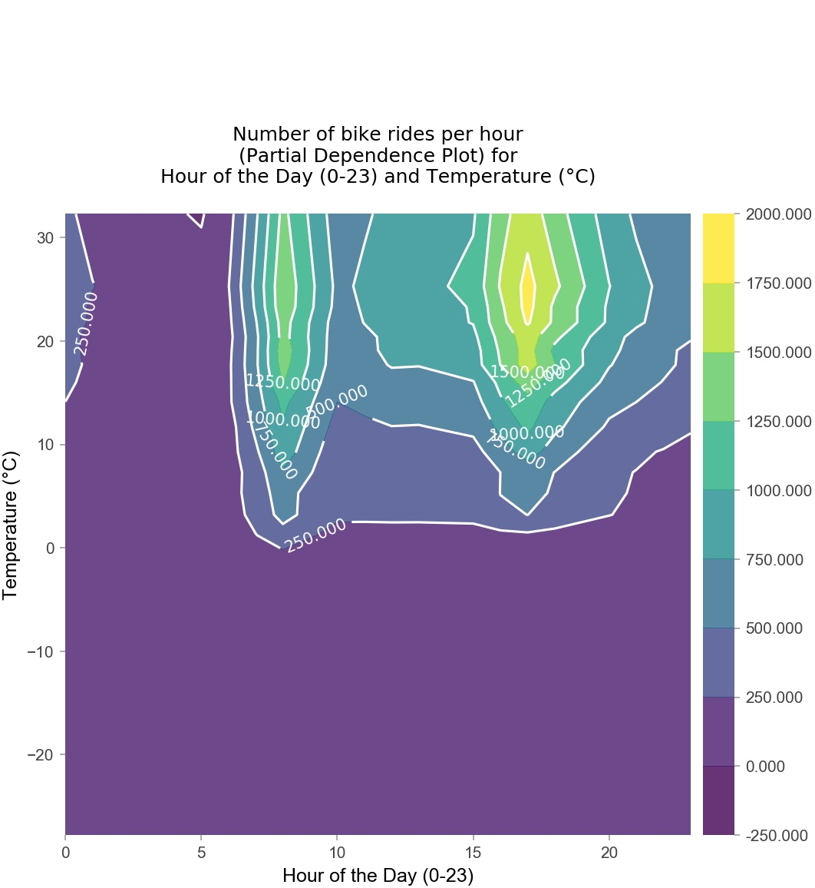
```
</div><!-- ------------------------------------ end of first column                 -->
<div style="float: left; width: 4%"><br></div><!-- spacing column ----------------- -->
<div style="float: left; width: 43%; margin-top: -11%"><!-- ---- start of second column              --> 
```{r, eval = TRUE, echo = FALSE, out.width = "100%", fig.align = "left"}
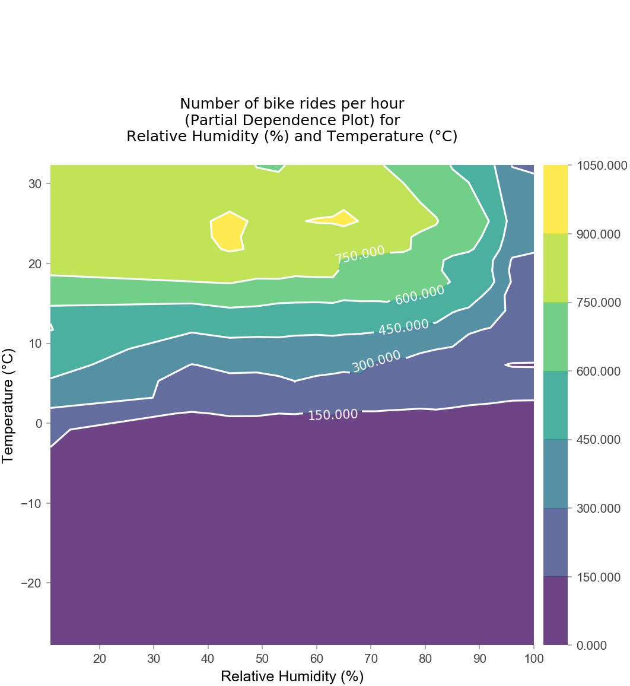
```

</div><!-- ------------------------------------ end of second column                -->
<div style="clear: both"></div><!-- end cols for text over both cols below -->

The interaction between **temperature and hour of the day** is the strongest
two-way interaction. The plot shows that the main effect (peaks at rush hour) 
is only valid for temperatures above approx. $0°$C. This also applies for 
the interaction between **temperature and relative humidity**: 
The number of predicted bike rides drops with increasing relative humidity 
only for temperatures above $0°$C. For lower temperatures, 
there are hardly any rides at all.


 
## Limitations

* Results only valid for cities with roughly the same climate.
* Bike rides might be influenced by weather *predictions* for a given day, not only by the actual weather.
* Precipitation (rain, snow) might also be a very good predictor; unfortunately, this was not easily available for the given weather station.
* Maybe have slightly overfitted the training data, but still a good result (MAE).
* Missing values: ignored / imputed?
* Using time and month also, or only weather data?
* continuous vs categorical features for hour of day and day of week etc.

> If applicable, describe limitations to your findings. For example, you might note that these results were true for British Premier league players but may not be applicable to other leagues because of differences in league structures.
> Or you may note that your data has inherent limitations. For example, you may not have access to the number of Twitter followers per users so you assumed all users are equally influential. If you had the number of followers, you could weight the impact of their tweet’s sentiment by their influence (# of followers).

## Conclusions

> Report your overall conclusions, preferably a conclusion per research question
 
## Acknowledgements
Where did you get your data? Did you use other informal analysis to inform your work? Did you get feedback on your work by friends or colleagues? Etc. If you had no one give you feedback and you collected the data yourself, say so.
 
## References {.columns-2 .tiny}
