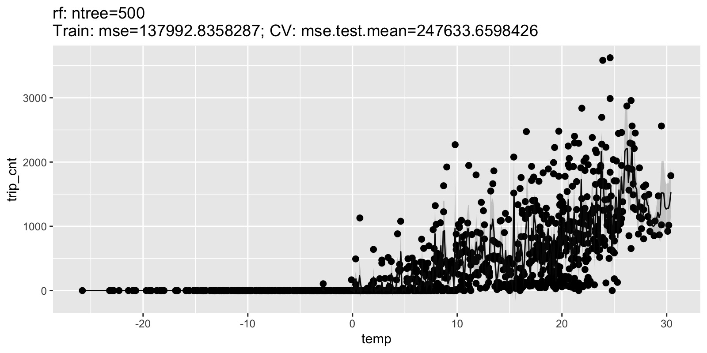
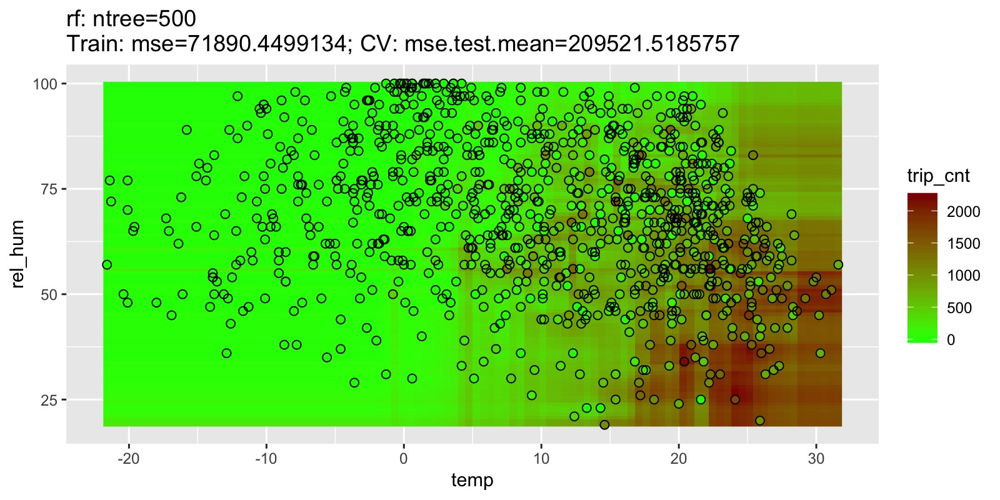
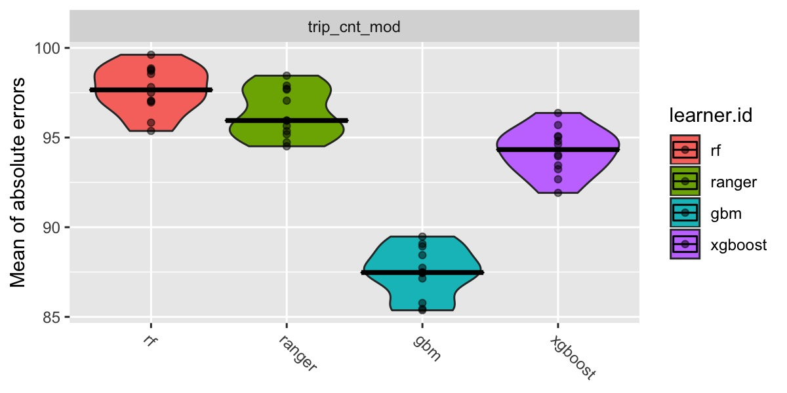

[//]: # (
http://www.w3schools.com/css/css_font.asp
http://www.cssfontstack.com/Helvetica
)

<style>  <!-- put CSS here to test quickly -->
</style>

<script type="text/x-mathjax-config">  <!-- LaTeX formula config -->
MathJax.Hub.Config({
  jax: ["input/TeX", "output/HTML-CSS"],
  "HTML-CSS": { 
      preferredFont: "Arial", 
      availableFonts: [],
      scale: 85
      // styles: {".MathJax": {color: "#CCCCCC"}} 
      }
});
</script>


## Background and Overview 

* Based on work for edX-Course [Python for Data Science](https://courses.edx.org/courses/course-v1:UCSanDiegoX+DSE200x+2T2017/course/)
* investigates **to what extent** and 
**how weather and time of day** influence **bike rentals** 
in a public bike sharing system in Montreal.

* Analysis in Python for course (data prep, some ML models, interpretation)
* Redone using some new cool stuff in the R ecosystem:
  * `mlr` package as a common interface for machine learning in R
  * `iml` package for model interpretation ([Pointed out by Andreas/Slack](https://www.inovex.de/blog/machine-learning-interpretability/))

**Note**: Only parts of each package can be covered here! No model interpretation due to time constraints (in preparing the presentation).

<p style="font-size: 16px; margin-top: 1%">
The full analysis is available in multiple python files on github:  [kgl-cycle-share-main-file.py](https://github.com/ingonader/python-for-data-science-edx/blob/master/week-09-and-10-final-project/kgl-cycle-share-main-file.py).
<br>
A synopsis is available as an ipython notebook [cycle-share-analysis-synopsis.ipynb](https://github.com/ingonader/python-for-data-science-edx/blob/master/week-09-and-10-final-project/cycle-share-analysis-synopsis.ipynb), or as [html](https://github.com/ingonader/python-for-data-science-edx/blob/master/week-09-and-10-final-project/cycle-share-analysis-synopsis.html) to download.
</p>


## Dataset(s) {.smaller}

<div></div><!-- ------------------------------- needed, but don't put anything here -->
<div style="float: left; width: 48%;"><!-- ---- start of first column               -->

Two datasets were used: **Bike sharing data**...

* **BIXI Montreal public bicycle sharing system**, North America's first 
  large-scale bike sharing system
* Available via Kaggle from<br> [https://www.kaggle.com/aubertsigouin/biximtl/home](https://www.kaggle.com/aubertsigouin/biximtl/home)
* For years $2014$ to $2017$
* Contains **individual records of bike trips**: timestamp and station code for 
  start and end of trip, duration
* $n = 14598961$ records (individual bike trips)
* Station codes, names, and position (latitude, longitude) 
  available in separate files, but only of secondary interest for this analysis

</div><!-- ------------------------------------ end of first column                 -->
<div style="float: left; width: 4%"><br></div><!-- spacing column -------- -->
<div style="float: left; width: 48%;"><!-- ---- start of second column              --> 

...and **weather data** from the Canadian government:

* Canadian government’s past weather and climate service, available from<br> [http://climate.weather.gc.ca/ 
  historical_data/ <br> search_historic_data_e.html](http://climate.weather.gc.ca/historical_data/search_historic_data_e.html)
* API for **bulk data download**:<br> [http://climate.weather.gc.ca/climate_data/ <br> bulk_data_e.html](http://climate.weather.gc.ca/climate_data/bulk_data_e.html)
* Data can be downloaded per weather station per month and contains 
  **hourly measurements** of different metrics (e.g., timestamp, temperature, 
  relative humidity, atmospheric pressure, wind speed; different measures 
  available for different stations)
* $n = 35064$ hourly weather records in total (between $672$ and $744$ per monthly file)

</div><!-- ------------------------------------ end of second column                -->
<div style="clear: both"></div><!-- end floating section for text over both cols below -->


## Data Preparation and Cleaning {.smaller}

<div></div><!-- ------------------------------- needed as is before cols - -->
<div style="float: left; width: 48%;"><!-- ---- start of first column ---- -->

* First, **data download** was performed manually for the bike share data 
  from Kaggle (as only available after login), and via a Python script 
  for the weather data (bulk download).
* For the weather data, the **weather station** that was most central to the
  locations of the bike rides was picked (see data exploration).
* Next, the **data was loaded** and contatenated into a pandas `DataFrame` 
  each for individual bike rides and hourly weather data.
* The next step was **calculating the variable of interest: Hourly bike rides**. 
  This was done by aggregating individual bike trips to hourly counts of 
  trips (number of trips in each hour), using the starting time of the trip.
* Then, the **weather data was joined to the hourly bike ride data**, 
  using the common timestamp as join key.

</div><!-- ------------------------------------ end of first column ------ -->
<div style="float: left; width: 4%"><br></div><!-- spacing column -------- -->
<div style="float: left; width: 48%;"><!-- ---- start of second column --- --> 

* One feature **(wind chill) was dropped**, as it had too many 
  missing values ($77.9\%$ missing).
* Finally, **additional features were added** for the analysis: 
  hour of the day ($0$-$23$), day of the week ($0$-$6$, zero corresponding 
  to Monday, six corresponding to Sunday), month ($1$-$12$).
* These features, despite being categorical in nature, were kept as
  **continuous features**, as this proved to have more predictive
  power in the models.
* For modeling, **rows with missing values were dropped**, as the goal 
  is not having the most complete prediction coverage, but rather an 
  indication of the prediction quality that is possible with complete data. 
  In total, $1284$ rows ($0.04\%$) of the original data were dropped.
* The remaining rows were **split into training and testing set** ($90\%$ of the data, 
  $n = 26168$ rows for training, the remaining $10\%$, $n = 2908$ for testing).

</div><!-- ------------------------------------ end of second column ----- -->
<div style="clear: both"></div><!-- end cols for text over both cols below -->


## Research Question(s)

The research questions that I wanted to answer with my analysis were:

* **To what extent do** the number of 
  **bike rides depend on the current weather conditions**? That is, 
  how well can the number of bike rides 
  be predicted from weather data (and time of year, time of day)?
* What are the **most important factors** that influence the number 
  of bike rides?
* **How do these factors influence** the number of bike rides? What are 
  the main effects of these factors, and what are the interactions between
  them?


## Findings: Data Exploration

<div></div><!-- ------------------------------- needed, but don't put anything here -->
<div style="float: left; width: 53%"><!-- ---- start of first column               -->

* Context: **number of hourly bike trips** visualized for the time span between $2014$ and $2017$. 
* Baseline model: 
  * **Moving average**  (red line) 
  * $38.8\%$ variance explained $(r^2 = 0.388)$
  * Mean absolute error of $MAE = 316.2$

**Note**: 

* All data prep and exploration done in Python
* Data stored in `feather` format 
  (fast data exchange between R and Python)

</div><!-- ------------------------------------ end of first column                 -->

<div style="float: left; width: 2%"><br></div><!-- spacing column ----------------- -->
<div style="float: left; width: 45%; margin-top: -3%"><!-- ---- start of second column              --> 

<p style="font-size: 12px">
**Figure**: Number of hourly rides from $2014$ to $2017$. Each dot represents the 
number of trips in one specifc hour. Red line represents a 
moving average using a window of $14$ days.
<p>
</div><!-- ------------------------------------ end of second column                -->


## Methods

* $90\%$ training and $10\%$ test set 
* **Different machine learning models** (predicting hourly number of bike rides):
  * Random forest regression (`scikit-learn` / `randomForest`, `ranger`)
  * gradient boosting regression (`scikit-learn` / `gbm`)
  * gradient boosting regression via `xgboost` (Python and R)

* Hyperparameter tuning: randomized search with $4$-fold CV ($40$ iterations)
* Interpretation not part of this presentation  


## R package `mlr`: Overview

* **Standardized interface** for R's machine learning algorithms
* Infrastructure to:
  * **Resample** your models (cross validation, etc.)
  * **Select features**
  * Cope with **pre- and post-processing** of data 
  * **Optimize hyperparameters** (of models and also preprocessing)
  * **Compare models** in a statistically meaningful way
* Classification (including multilabel), regression, clustering, survival analysis
* Offers **parallelization** out of the box

**Note**: Only some parts of regression with hyperparameter tuning covered here.


## Building blocks

* **Task**: Data + meta data (target, positive class)
* **Learners**: Machine learning algorithms
  * `train()` $\rightarrow$ trained model: `predict()` , `performance()`, etc.
* **Resampling** strategy descriptions
  * `resample()` $\rightarrow$ trained model instances with performance metrics
* **Parameter tuners** $\rightarrow$ trained and tuned model
* **Benchmark experiments** $\rightarrow$ multiple trained models and their instances 
* **Wrappers** for Data preprocessing, Imputation, Over- and undersampling, Feature selection,  
  Bagging, Parameter Tuning
* **Plots**


## Tasks


```r
## load mlr package:
library(mlr)

## load housing data from package `mlbench`:
data(BostonHousing, package = "mlbench")

## define task
regr.task = makeRegrTask(id = "bh", 
                         data = BostonHousing, 
                         target = "medv")
regr.task
```

```
## Supervised task: bh
## Type: regr
## Target: medv
## Observations: 506
## Features:
##    numerics     factors     ordered functionals 
##          12           1           0           0 
## Missings: FALSE
## Has weights: FALSE
## Has blocking: FALSE
## Has coordinates: FALSE
```

## Tasks


```r
## create a task: (= data + meta-information)
task_full <- makeRegrTask(id = "trip_cnt_mod", 
                     data = dat_hr_mod[varnames_model],
                     target = varnames_target)

task <- subsetTask(task = task_full, subset = idx_train)

task_small <- subsetTask(task = task_full, 
                         subset = sample(idx_test, size = 1000))
```

Cycling trip data example: 

* One full task (for final model estimation with evaluation on a fixed test set)
* Subtask for CV within the training set
* Subtask with small sample size for plotting


## Learners


```r
## Classification tree, set it up for predicting probabilities:
classif_lrn <- makeLearner("classif.randomForest", 
                           predict.type = "prob", 
                           fix.factors.prediction = TRUE)

## Regression gradient boosting machine, specify hyperparameters via a list
regr_lrn = makeLearner("regr.gbm", 
                       par.vals = list(
                         n.trees = 500, 
                         interaction.depth = 3)
                       )
```

* Parameters like `predict.type` are standardized for all learners
* Model-specific parameters passed in `par.vals` list

## Learners: Parameters


```r
## define learner without basic parameters:
learner_rf <- makeLearner("regr.randomForest", 
                          par.vals = list(ntree = 500))
getParamSet(learner_rf)  ## or: getParamSet("regr.randomForest")
```

```
##                      Type  len   Def                 Constr Req Tunable Trafo
## ntree             integer    -   500               1 to Inf   -    TRUE     -
## se.ntree          integer    -   100               1 to Inf   Y    TRUE     -
## se.method        discrete    -    sd bootstrap,jackknife,sd   Y    TRUE     -
## se.boot           integer    -    50               1 to Inf   -    TRUE     -
## mtry              integer    -     -               1 to Inf   -    TRUE     -
## replace           logical    -  TRUE                      -   -    TRUE     -
## strata            untyped    -     -                      -   -   FALSE     -
## sampsize    integervector <NA>     -               1 to Inf   -    TRUE     -
## nodesize          integer    -     5               1 to Inf   -    TRUE     -
## maxnodes          integer    -     -               1 to Inf   -    TRUE     -
## importance        logical    - FALSE                      -   -    TRUE     -
## localImp          logical    - FALSE                      -   -    TRUE     -
## nPerm             integer    -     1            -Inf to Inf   -    TRUE     -
## proximity         logical    - FALSE                      -   -   FALSE     -
## oob.prox          logical    -     -                      -   Y   FALSE     -
## do.trace          logical    - FALSE                      -   -   FALSE     -
## keep.forest       logical    -  TRUE                      -   -   FALSE     -
## keep.inbag        logical    - FALSE                      -   -   FALSE     -
```

## List of Learners


```r
## get list of learners:
listLearners(warn.missing.packages = FALSE)
```

```
##                 class                               name  short.name      package    type installed numerics factors
## 1         classif.ada                       ada Boosting         ada    ada,rpart classif      TRUE     TRUE    TRUE
## 2  classif.adaboostm1                    ada Boosting M1  adaboostm1        RWeka classif     FALSE     TRUE    TRUE
## 3 classif.bartMachine Bayesian Additive Regression Trees bartmachine  bartMachine classif     FALSE     TRUE    TRUE
## 4    classif.binomial                Binomial Regression    binomial        stats classif      TRUE     TRUE    TRUE
## 5    classif.boosting                    Adabag Boosting      adabag adabag,rpart classif      TRUE     TRUE    TRUE
## 6         classif.bst                  Gradient Boosting         bst    bst,rpart classif      TRUE     TRUE   FALSE
##   ordered missings weights  prob oneclass twoclass multiclass class.weights featimp oobpreds functionals
## 1   FALSE    FALSE   FALSE  TRUE    FALSE     TRUE      FALSE         FALSE   FALSE    FALSE       FALSE
## 2   FALSE    FALSE   FALSE  TRUE    FALSE     TRUE       TRUE         FALSE   FALSE    FALSE       FALSE
## 3   FALSE     TRUE   FALSE  TRUE    FALSE     TRUE      FALSE         FALSE   FALSE    FALSE       FALSE
## 4   FALSE    FALSE    TRUE  TRUE    FALSE     TRUE      FALSE         FALSE   FALSE    FALSE       FALSE
## 5   FALSE     TRUE   FALSE  TRUE    FALSE     TRUE       TRUE         FALSE    TRUE    FALSE       FALSE
## 6   FALSE    FALSE   FALSE FALSE    FALSE     TRUE      FALSE         FALSE   FALSE    FALSE       FALSE
##   single.functional    se lcens rcens icens
## 1             FALSE FALSE FALSE FALSE FALSE
## 2             FALSE FALSE FALSE FALSE FALSE
## 3             FALSE FALSE FALSE FALSE FALSE
## 4             FALSE FALSE FALSE FALSE FALSE
## 5             FALSE FALSE FALSE FALSE FALSE
## 6             FALSE FALSE FALSE FALSE FALSE
## ... (#rows: 167, #cols: 24)
```

## List of Learners with properties


```r
## get list of learners wich certain properties::
listLearners("regr", properties = c("missings", "weights"), warn.missing.packages = FALSE)
```

```
##                   class                                               name short.name         package type installed
## 1          regr.cforest Random Forest Based on Conditional Inference Trees    cforest           party regr      TRUE
## 2            regr.ctree                        Conditional Inference Trees      ctree           party regr      TRUE
## 3              regr.gbm                          Gradient Boosting Machine        gbm             gbm regr      TRUE
## 4 regr.h2o.deeplearning                                   h2o.deeplearning     h2o.dl             h2o regr      TRUE
## 5          regr.h2o.glm                                            h2o.glm    h2o.glm             h2o regr      TRUE
## 6  regr.randomForestSRC                                      Random Forest      rfsrc randomForestSRC regr      TRUE
##   numerics factors ordered missings weights  prob oneclass twoclass multiclass class.weights featimp oobpreds
## 1     TRUE    TRUE    TRUE     TRUE    TRUE FALSE    FALSE    FALSE      FALSE         FALSE    TRUE    FALSE
## 2     TRUE    TRUE    TRUE     TRUE    TRUE FALSE    FALSE    FALSE      FALSE         FALSE   FALSE    FALSE
## 3     TRUE    TRUE   FALSE     TRUE    TRUE FALSE    FALSE    FALSE      FALSE         FALSE    TRUE    FALSE
## 4     TRUE    TRUE   FALSE     TRUE    TRUE FALSE    FALSE    FALSE      FALSE         FALSE   FALSE    FALSE
## 5     TRUE    TRUE   FALSE     TRUE    TRUE FALSE    FALSE    FALSE      FALSE         FALSE   FALSE    FALSE
## 6     TRUE    TRUE    TRUE     TRUE    TRUE FALSE    FALSE    FALSE      FALSE         FALSE    TRUE     TRUE
##   functionals single.functional    se lcens rcens icens
## 1       FALSE             FALSE FALSE FALSE FALSE FALSE
## 2       FALSE             FALSE FALSE FALSE FALSE FALSE
## 3       FALSE             FALSE FALSE FALSE FALSE FALSE
## 4       FALSE             FALSE FALSE FALSE FALSE FALSE
## 5       FALSE             FALSE FALSE FALSE FALSE FALSE
## 6       FALSE             FALSE FALSE FALSE FALSE FALSE
## ... (#rows: 8, #cols: 24)
```

## Unified Interface


```r
## train learner:
model <- train(learner = learner_rf, task = task_full, subset = idx_train)
model
```
```
Model for learner.id=regr.randomForest; learner.class=regr.randomForest
Trained on: task.id = trip_cnt_mod; obs = 26168; features = 8
Hyperparameters: ntree=500
```

```r
## access model:
getLearnerModel(model) %>% class()
```
```
[1] "randomForest"
```

```r
getLearnerModel(model)
```
```
Call:
 randomForest(x = data[["data"]], y = data[["target"]], ntree = 500,     
              keep.inbag = if (is.null(keep.inbag)) TRUE else keep.inbag) 
               Type of random forest: regression
                     Number of trees: 500
No. of variables tried at each split: 2

          Mean of squared residuals: 41190.02
                    % Var explained: 90.01
```

## Unified Interface


```r
## predict with learner:
pred <- predict(model, newdata = dat_hr_mod, subset = idx_test)
pred
```
```
Prediction: 2908 observations
predict.type: response
threshold: 
time: 1.47
   truth  response
2      5  42.53462
6      5  30.70638
... (#rows: 2912, #cols: 2)
```

## Inspect Learner Predictions

<div></div><!-- ------------------------------- needed as is before cols - -->
<div style="float: left; width: 48%;"><!-- ---- start of first column ---- -->

```r
## inspect predictions on a small subset
set.seed(1548)
task_small_prelim <- subsetTask(
  task = task_full, 
  subset = sample(idx_test, size = 1000)
)

plotLearnerPrediction(
  learner_rf, task = task_small_prelim, 
  features = "temp"
)

plotLearnerPrediction(
  learner_rf,
  task = task_small_prelim, features = c("temp", "rel_hum")
)
```
</div><!-- ------------------------------------ end of first column ------ -->
<div style="float: left; width: 4%"><br></div><!-- spacing column -------- -->
<div style="float: left; width: 48%;"><!-- ---- start of second column --- -->


</div><!-- ------------------------------------ end of second column ----- -->
<div style="clear: both"></div><!-- end cols for text over both cols below -->


## Performance Measures


```r
## assess performance of learner:
performance(pred, measures = list(mse, mae, rsq))
```
```
        mse         mae         rsq 
42114.37355   110.04546     0.89036 
```


```r
## list of suitable measures for a task:
listMeasures()
```

```
##  [1] "tnr"                 "iauc.uno"            "tpr"                 "featperc"            "mae"                
##  [6] "multilabel.tpr"      "f1"                  "mmce"                "mape"                "ibrier"             
## [11] "multilabel.hamloss"  "db"                  "mcc"                 "brier.scaled"        "medse"              
## [16] "mcp"                 "lsr"                 "msle"                "rae"                 "bac"                
## [21] "fn"                  "fp"                  "fnr"                 "spearmanrho"         "multilabel.subset01"
## [26] "qsr"                 "fpr"                 "npv"                 "brier"               "auc"                
## [31] "meancosts"           "timeboth"            "multiclass.aunp"     "timetrain"           "multiclass.aunu"    
## [36] "rmsle"               "ber"                 "timepredict"         "medae"               "sse"                
## [41] "multiclass.brier"    "ssr"                 "ppv"                 "multilabel.ppv"      "dunn"               
## [46] "expvar"              "acc"                 "logloss"             "kendalltau"          "rmse"               
## [51] "wkappa"              "cindex.uno"          "multilabel.f1"       "mse"                 "tn"                 
## [56] "tp"                  "rrse"                "multiclass.au1p"     "multiclass.au1u"     "sae"                
## [61] "multilabel.acc"      "silhouette"          "fdr"                 "G1"                  "kappa"              
## [66] "G2"                  "rsq"                 "cindex"              "gpr"                 "gmean"              
## [71] "arsq"
```

## Cross Validation


```r
## set random seed, also valid for parallel execution:
set.seed(4271, "L'Ecuyer")

## choose resampling strategy for parameter tuning:
rdesc <- makeResampleDesc(predict = "both", 
                          method = "CV", iters = 4)

## not needed: estimating performance using resampling:
res <- resample(learner = "regr.ranger", task = task, 
                resampling = rdesc,
                measures = list(mse, mae, rsq))
```

```
Resampling: cross-validation
Measures:             mse.test   mae.test   rsq.test   
[Resample] iter 1:    113423.0606216188.7838823   0.7348283     
[Resample] iter 2:    65289.2298107164.0962026  0.8057397    
[Resample] iter 3:    109819.4070038195.5073898   0.7204328     
[Resample] iter 4:    102574.8995368195.6119237   0.7466122     

Aggregated Result: mse.test.mean=97776.6492433,mae.test.mean=185.9998496,rsq.test.mean=0.7519033
```

## Parallelism

<div></div><!-- ------------------------------- needed as is before cols - -->
<div style="float: left; width: 53%;"><!-- ---- start of first column ---- -->
Supported backends for parallelism:

* local multicore execution using `parallel`
* socket and MPI clusters using `snow`
* makeshift SSH-clusters using `BatchJobs`
* high performance computing clusters  
  (managed by a scheduler like SLURM, Torque/PBS, SGE or LSF) also using BatchJobs.
</div><!-- ------------------------------------ end of first column ------ -->

<div style="float: left; width: 4%"><br></div><!-- spacing column -------- -->
<div style="float: left; width: 43%;"><!-- ---- start of second column --- --> 
<!-- <td style="padding-top: 2px;">...</td> -->

```r
## enable parallel execution on a multicore machine: 
library(parallelMap)
parallelStartMulticore(cpus = n_cpus, 
                       level = "mlr.resample")
```

<br>
Parallelism can be set to different execution levels:


```r
parallelGetRegisteredLevels()
```
```
mlr: mlr.benchmark, mlr.resample, mlr.selectFeatures, 
     mlr.tuneParams, mlr.ensemble
```

</div><!-- ------------------------------------ end of second column ----- -->
<div style="clear: both"></div><!-- end cols for text over both cols below -->


## Parameter tuning

<div></div><!-- ------------------------------- needed as is before cols - -->
<div style="float: left; width: 68%;"><!-- ---- start of first column ---- -->

```r
## tuning strategy for parameter tuning:
ctrl <- makeTuneControlRandom(maxit = 40)
tune_measures <- list(rmse, mae, rsq, timetrain, timepredict)

## tune standard random forest implementation:
tune_results_rf <- tuneParams(
  "regr.randomForest", 
  task = task, resampling = rdesc, measures = tune_measures, control = ctrl,
  par.set = makeParamSet(
    makeIntegerParam("mtry", lower = 2, upper = length(varnames_features)),
    makeIntegerParam("nodesize", lower = 10, upper = 50),
    makeIntegerParam("ntree", lower = 100, upper = 500)
  )
)
tune_results_rf
```
```
Tune result:
Op. pars: mtry=6; nodesize=10; ntree=445
rmse.test.rmse=182.8800473,mae.test.mean=96.1463276,rsq.test.mean=0.9188789,
timetrain.test.mean=168.3022500,timepredict.test.mean=0.5545000
```
</div><!-- ------------------------------------ end of first column ------ -->

<div style="float: left; width: 8%"><br></div><!-- spacing column -------- -->
<div style="float: left; width: 24%;"><!-- ---- start of second column --- --> 


```r
## access tuned parameters:
tune_results_rf$x
```
```
$mtry
[1] 6

$nodesize
[1] 10

$ntree
[1] 445
```
</div><!-- ------------------------------------ end of second column ----- -->
<div style="clear: both"></div><!-- end cols for text over both cols below -->


## Benchmark experiments


```r
lrns_tuned <- list(
  makeLearner("regr.randomForest",  par.vals = tune_results_rf$x),
  makeLearner("regr.ranger", par.vals = tune_results_ranger$x),
  makeLearner("regr.gbm", par.vals = tune_results_gbm$x),
  makeLearner("regr.xgboost", par.vals = tune_results_xgboost$x)
)

## set resampling strategy for benchmarking:
rdesc_bm <- makeResampleDesc(predict = "both", 
                             method = "RepCV", reps = 3, folds = 4)

## refit tuned models on complete training data:
bmr_train <- benchmark(
  lrns_tuned, task, rdesc_bm,
  measures = list(rmse, mae, rsq,
                  timetrain, timepredict)
)
```

```r
bmr_train
```

```
##        task.id        learner.id rmse.test.rmse mae.test.mean rsq.test.mean timetrain.test.mean timepredict.test.mean
## 1 trip_cnt_mod regr.randomForest       306.4047      178.1144     0.7836792           0.6719167           0.012166667
## 2 trip_cnt_mod       regr.ranger       305.2945      176.6672     0.7847848           0.4576667           0.034166667
## 3 trip_cnt_mod          regr.gbm       311.6069      200.2793     0.7755389           0.1928333           0.006166667
## 4 trip_cnt_mod      regr.xgboost       306.5771      181.4005     0.7813123           0.4819167           0.005750000
```


## Visualizing benchmark experiments


```r
bmr_train
```

```
##        task.id        learner.id rmse.test.rmse mae.test.mean rsq.test.mean timetrain.test.mean timepredict.test.mean
## 1 trip_cnt_mod regr.randomForest       306.4047      178.1144     0.7836792           0.6719167           0.012166667
## 2 trip_cnt_mod       regr.ranger       305.2945      176.6672     0.7847848           0.4576667           0.034166667
## 3 trip_cnt_mod          regr.gbm       311.6069      200.2793     0.7755389           0.1928333           0.006166667
## 4 trip_cnt_mod      regr.xgboost       306.5771      181.4005     0.7813123           0.4819167           0.005750000
```

<div></div><!-- ------------------------------- needed as is before cols - -->
<div style="float: left; width: 48%;"><!-- ---- start of first column ---- -->
R and Python results:

<p style="margin-top: -4%">
|Model                                       |   $r^2_{test}$| $MAE_{test}$|
|:----------------------------               |--------------:|------------:|
|Gradient Boosting (Python/sklearn)          |        $0.941$|       $85.4$|
|Gradient Boosting  (R/XGBoost)              |        $0.931$|       $93.4$|
|Random Forest (R/randomForest)              |        $0.919$|       $95.8$|
|Random Forest (R/ranger)                    |        $0.918$|       $97.0$|
|Gradient Boosting  (R/gbm)                  |        $0.927$|      $101.8$|
|Random Forest (Python/sklearn)              |        $0.894$|      $111.2$|
|Gradient Boosting (Python/XGBoost)          |        $0.865$|      $155.3$|
</p>

</div><!-- ------------------------------------ end of first column ------ -->
<div style="float: left; width: 4%"><br></div><!-- spacing column -------- -->
<div style="float: left; width: 48%;"><!-- ---- start of second column --- --> 

```r
plotBMRBoxplots(bmr_train, measure = mae, style = "violin") +
  aes(fill = learner.id) + geom_point(alpha = .5)
```

</div><!-- ------------------------------------ end of second column ----- -->
<div style="clear: both"></div><!-- end cols for text over both cols below -->


## Python Modeling Discussion

Using `patsy` design matrices for formula interface:


```python
## formula as text for patsy: without interactions
formula_txt = target + ' ~ ' + \
    ' + '.join(features) + ' - 1'
formula_txt
```
```
"Q('trip_cnt') ~ Q('Month') + Q('Temp (°C)') + Q('Rel Hum (%)') + Q('Wind Dir (10s deg)') + 
 Q('Wind Spd (km/h)') + Q('Stn Press (kPa)') + Q('hr_of_day') + Q('day_of_week') - 1"
```

```python
## create design matrices using patsy (could directly be used for modeling):
dat_y, dat_x = patsy.dmatrices(formula_txt, dat_hr_all, 
                               NA_action = 'drop',
                               return_type = 'dataframe')
```

## Python Modeling Discussion (cont'd)

Train/test split and data type issues:


```python
## Split the data into training/testing sets (using patsy/dmatrices):
dat_train_x, dat_test_x, dat_train_y, dat_test_y = train_test_split(
    dat_x, dat_y, test_size = 0.1, random_state = 142)

## convert y's to Series (to match data types between patsy and non-patsy data prep:)
dat_train_y = dat_train_y[target]
dat_test_y = dat_test_y[target]
```


## Python Modeling Discussion (cont'd)


```python
## Instantiate random forest estimator:
mod_gb = GradientBoostingRegressor(
  n_estimators = 100, random_state = 42,
  loss = 'ls', learning_rate = 0.1,
  max_depth = 20, 
  min_samples_split = 70,min_samples_leaf = 30
)
# specify parameters and distributions to sample from:
param_distributions = { 
    "n_estimators" : stats.randint(50, 201),
    "learning_rate" : [0.2, 0.1, 0.05],
    "max_depth" : stats.randint(4, 21),
    "min_samples_leaf" : stats.randint(30, 61)
}
mod_randsearch = RandomizedSearchCV(
    estimator = mod_gb,
    param_distributions = param_distributions,
    n_iter = 40,
    scoring = "r2",
    cv = 4,
    random_state = 7, n_jobs = -1
)
mod_randsearch.fit(dat_train_x, dat_train_y)

## get best model (estimator): 
mod_gb = mod_randsearch.best_estimator_
```


## Links

* https://mlr.mlr-org.com/: MLR Homepage
* https://arxiv.org/abs/1609.06146: MLR tutorial
* https://www.inovex.de/blog/machine-learning-interpretability: Blog post on ML interpretability using the `mlr` package


<!-- ## References {.columns-2 .tiny} -->
